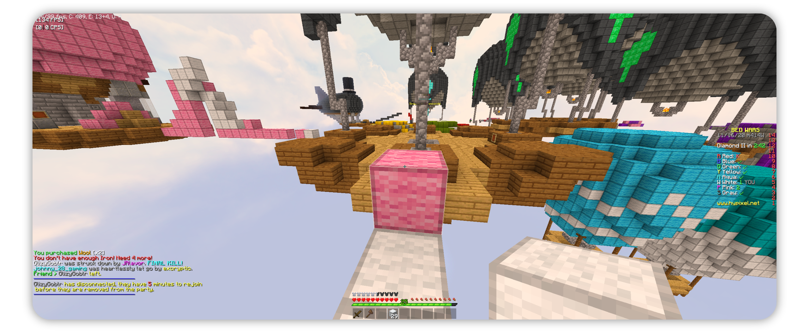

<h1 align="center">
     
    
     
    Chromofault
     
</h1>

A clean default edit for minecraft by <a href="http://www.chromus.tk" target="_blank">Chromus</a>.

<h2 align="center">Credits</h2>
 

**NOTE** I try to give credit to those that created the textures but I'm not great at keeping track. If you believe some textures are yours please contact me and I'll add you to this list (or remove your textures upon request).

- [Jappa](https://twitter.com/JasperBoerstra): Base textures
- [StormDragon77](https://www.planetminecraft.com/member/stormdragon77): Better bedrock, Better Blaze, Better Creeper, various textures from [Fixed Iconsistencies](https://www.planetminecraft.com/texture-pack/fixed-inconsistencies/)
- [Kemiu](https://www.planetminecraft.com/member/kemiu/): Better Dirt
- [Daggsy](https://www.planetminecraft.com/member/daggsy): Hot Lava Bucket
- [Tamu](https://sites.google.com/view/tamuvt/home): Better Flint and Steel, Better Ores (Modified)